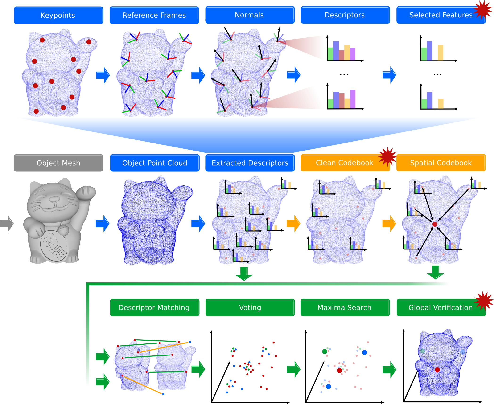

# PointCloudDonkey
A Hough-Space-based Nearest Neighbor Object Recognition Pipeline for Point Clouds



The maneki-neko (lucky cat) mesh model is intellectual property of user bs3 (taken from [thingiverse](https://www.thingiverse.com/thing:923097) and converted to a point cloud).

---

## Description

PointCloudDonkey is a customizable pipeline based on the <a href="http://pointclouds.org" target="_blank">Point Cloud Library (PCL)</a> for point cloud classification. The development started as an adaptation of the Implicit Shape Model (ISM) [1] algorithm to point cloud data. There are still many references to ISM in the code. Over time, the framework was extended and became a general, local feature, Hough-Space voting approach for point cloud classification. It allows to classify point cloud objects and localize them amongst clutter (the latter part still being in development).

The following table summarizes classification results on some datasets. For more information please refer to the publications linked in the [Citing](#Citing) section.

| 3D-Data Set | Base Pipeline<sup>[2](#fnbasep)</sup> | Base Pipeline<sup>[3](#fnbasep2)</sup> | Extended Pipeline<sup>[4](#fnbasepext)</sup> |
| ---  | ---    | --- | --- |
| Aim@Shape<sup>[1](#fnaim)</sup> | 85.0 | 90.0 | 93.5 |
| [McGill 3D Shape Benchmark](http://www.cim.mcgill.ca/~shape/benchMark/) | - |85.2 | 86.6 |
| [Princeton Shape Benchmark](http://shape.cs.princeton.edu/benchmark/) | 61.7 | 67.0 | 68.4 |
| [Shrec 2012](https://www.itl.nist.gov/iad/vug/sharp/contest/2012/Generic3D/) | -| 70.2 | 74.5
| [ModelNet 10](http://modelnet.cs.princeton.edu/) | - | 62.4 | 83.8 |
| [ModelNet 40](http://modelnet.cs.princeton.edu/) | - |71.9 | 75.4 |

<a name="fnaim">1</a>: Dataset no longer online <br>
<a name="fnbasep">2</a>: Pipeline **excluding** steps marked with a red star in the image above [\[bibtex\]](https://github.com/vseib/PointCloudDonkey/wiki/List_of_Related_Papers#Implicit-Shape-Models-For-3D-Shape-Classification-With-a-Continuous-Voting-Space) [\[PDF\]](http://www.uni-koblenz.de/~agas/Documents/Seib2015ISM.pdf) and [\[bibtex\]](https://github.com/vseib/PointCloudDonkey/wiki/List_of_Related_Papers#Pose-Estimation-and-Shape-Retrieval-with-Hough-Voting-in-a-Continuous-Voting-Space) [\[PDF\]](http://www.uni-koblenz.de/~agas/Documents/Seib2015PEA.pdf)<br>
<a name="fnbasep">3</a>: Optimized parameters in training [\[bibtex\]](https://github.com/vseib/PointCloudDonkey/wiki/List_of_Related_Papers#Boosting-3D-Shape-Classification-with-Global-Verification-and-Redundancy-Free-Codebooks) [\[PDF\]](http://www.uni-koblenz.de/~agas/Documents/Seib2019B3S.pdf) <br> 
<a name="fnbasep">4</a>: Pipeline **including** orange and green steps marked with a red star in the image above [\[bibtex\]](https://github.com/vseib/PointCloudDonkey/wiki/List_of_Related_Papers#Boosting-3D-Shape-Classification-with-Global-Verification-and-Redundancy-Free-Codebooks) [\[PDF\]](http://www.uni-koblenz.de/~agas/Documents/Seib2019B3S.pdf)<br>

| RGB-D Data Set | Base Pipeline<sup>[3](#fnbasep2)</sup> | Base Pipeline with Short CSHOT<sup>[5](#fnbasescsh)</sup> |
| ---  | ---    | --- | 
| [Washington RGB-D](https://rgbd-dataset.cs.washington.edu/) (partial) | 91.6/83.4 | 91.0/82.8 |
| [BigBird](https://rll.berkeley.edu/bigbird/) | 84.0/71.2 | 91.0/81.7 |
| [YCB](https://www.ycbbenchmarks.com/) | 87.9/73.2 | 81.4/68.6 |

<a name="fnbasescsh">5</a>: TODO [\[bibtex\]](https://github.com/vseib/PointCloudDonkey/wiki/List_of_Related_Papers#Boosting-3D-Shape-Classification-with-Global-Verification-and-Redundancy-Free-Codebooks) [\[PDF\]](http://www.uni-koblenz.de/~agas/Documents/Seib2019B3S.pdf) <br>

## Acknowledgments

The development of this framework started during the Master's thesis of Norman Link, that I supervised. I am very thankful to Norman for his contributions. Please check out other projects of Norman on GitHub in [Norman's repository](https://github.com/Norman0406).

Further, I would like to thank the developers of third party libraries used in this project: 
* [Compact Geometric Features](https://marckhoury.github.io/CGF/)
* [cnpy Library](https://github.com/rogersce/cnpy)
* [gdiam Library](https://sarielhp.org/research/papers/00/diameter/diam_prog.html)
* [lzf Library](http://oldhome.schmorp.de/marc/liblzf.html)
* [B-SHOT Descriptor](https://github.com/saimanoj18/iros_bshot)

## Installation

This framework was tested with Ubuntu 14.04 LTS, Ubuntu 16.04 LTS and Ubuntu 18.04 LTS.
The installation instructions can be found on the Wiki pages.

[Ubuntu 14.04 LTS](https://github.com/vseib/PointCloudDonkey/wiki/Installation_Ubuntu_14.04_LTS)

[Ubuntu 16.04 LTS](https://github.com/vseib/PointCloudDonkey/wiki/Installation_Ubuntu_16.04_LTS)

[Ubuntu 18.04 LTS](https://github.com/vseib/PointCloudDonkey/wiki/Installation_Ubuntu_18.04_LTS)


## Quick Start

To quickly start training a classifier to classify isolated point clouds, refer to the instructions on the following Wiki pages.

[Quick Start Using the Command Line](https://github.com/vseib/PointCloudDonkey/wiki/Quick_Start_Using_Command_Line)

TODO: [Quick Start Using the GUI]

## Documentation

### Preparing Point Clouds

TODO

### Preparing a File List

TODO

### Preparing a Config File

TODO

### Detailed Config File Documentation

TODO

## Citing

If you are using this repository for academic work, please consider citing the publication listed below.
If you consider citing a specific contribution contained in this repository, please refer to the following Wiki page:

[Citing This Repository](https://github.com/vseib/PointCloudDonkey/wiki/List_of_Related_Papers)

### Boosting 3D Shape Classification with Global Verification and Redundancy-Free Codebooks
* Paper introducing codebook cleaning and global verification
* This extended pipeline is the generic point cloud processing pipeline depicted in the image on top of this page including the orange and green steps marked with a red star.
* PDF: [Seib2019B3S](http://www.uni-koblenz.de/~agas/Documents/Seib2019B3S.pdf)

```
@inproceedings{Seib2019B3S,
   author = {Seib, Viktor and Theisen, Nick and Paulus, Dietrich},
   editor = {Tremeau, Alain and Farinella, Giovanni Maria and Braz, Jose},
   title = {Boosting 3D Shape Classification with Global Verification and Redundancy-free Codebooks},
   booktitle = {Proceedings of the 14th International Joint Conference on Computer Vision, Imaging and Computer Graphics Theory and Applications},
   publisher = {SciTePress},
   volume = {5},
   pages = {257 - 264},
   year = {2019},
   url = {http://www.uni-koblenz.de/~agas/Documents/Seib2019B3S.pdf},
   isbn = {978-989-758-354-4},
}
```


## License

PointCloudDonkey is released under the BSD-3-Clause license. See [LICENSE](LICENSE) for details.
PointCloudDonkey also includes some 3rd party code which might be subject to other licenses.

## References

[1] Leibe, Bastian and Leonardis, Ales and Schiele, Bernt; 
"Combined Object Categorization and Segmentation with an Implicit Shape Model",
Workshop on statistical learning in computer vision, ECCV, 2004

